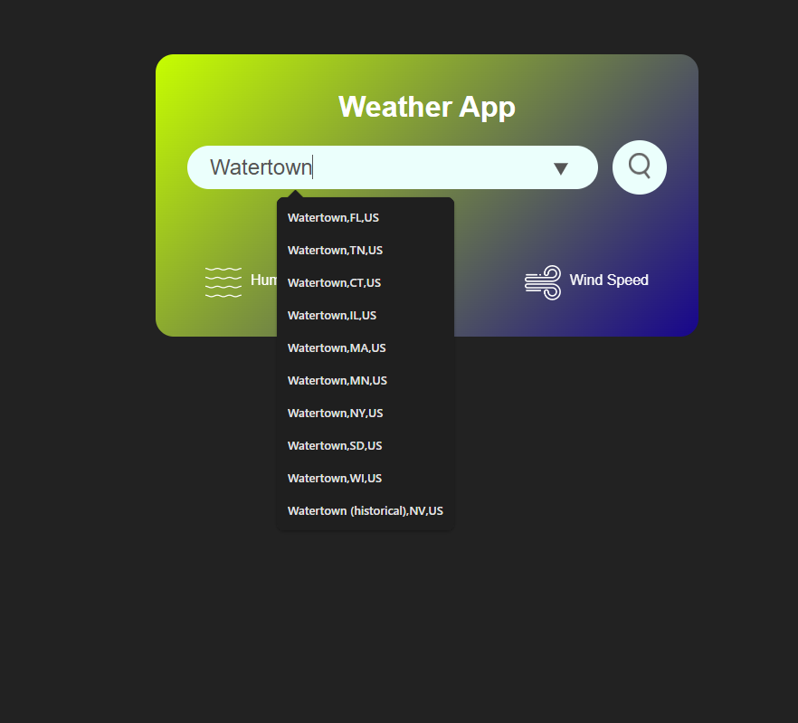
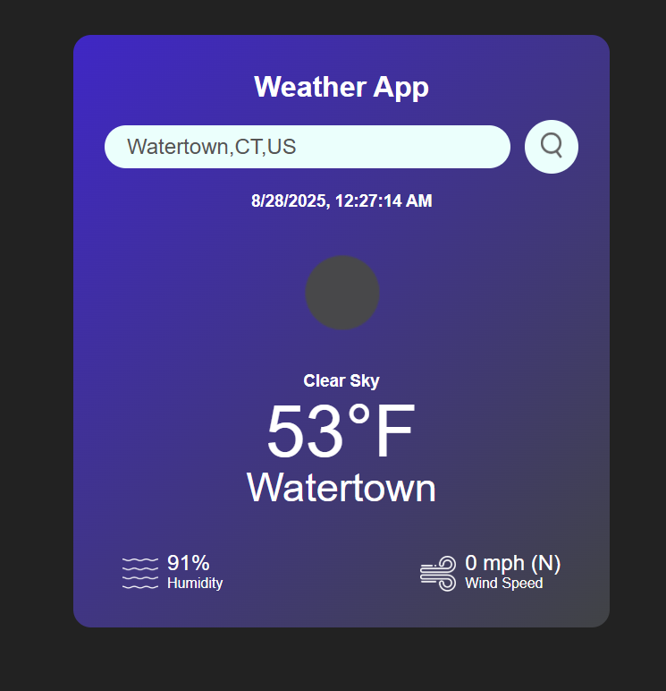
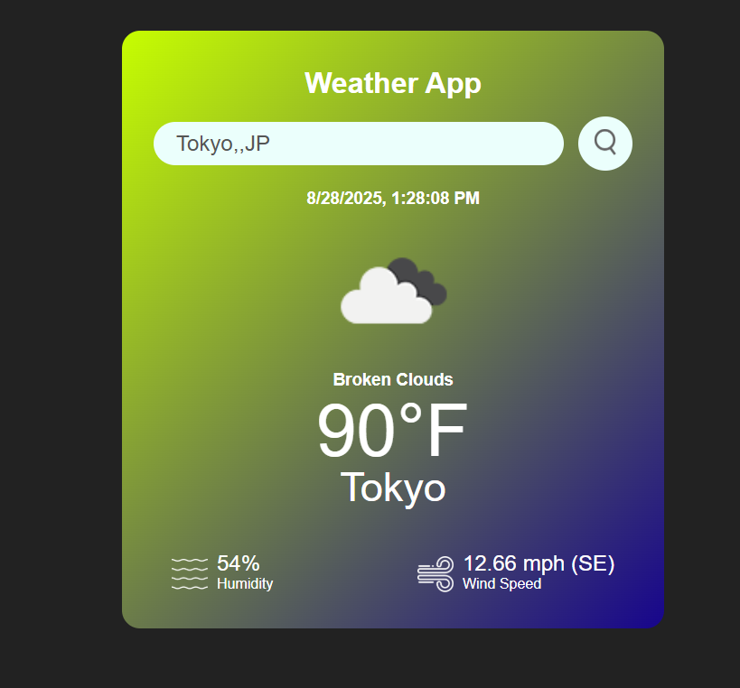

# 🌦️ Weather App

A simple **Weather Application** built with **HTML, CSS, and JavaScript**.  
This project was originally based on a tutorial, but expanded to make full use of the weather API features.

---

## 🚀 Features
- 🌍 **Dynamic City Search** → Enter any city, and the app pulls live data directly from the API’s full city list.  
- 🌤️ **Weather Icons** → Displays API-provided images (e.g., sun, clouds, rain) for a more visual experience.  
- 🌡️ **Current Conditions** → Temperature, humidity, wind speed, wind direction and weather description.  
- 📅 **Extended API Options** → Access to additional data points beyond the basic tutorial.
- ⏰ **Dynamic Background** → The background changes automatically based on the **time of day**. 

---

## 🖼️ Demo

